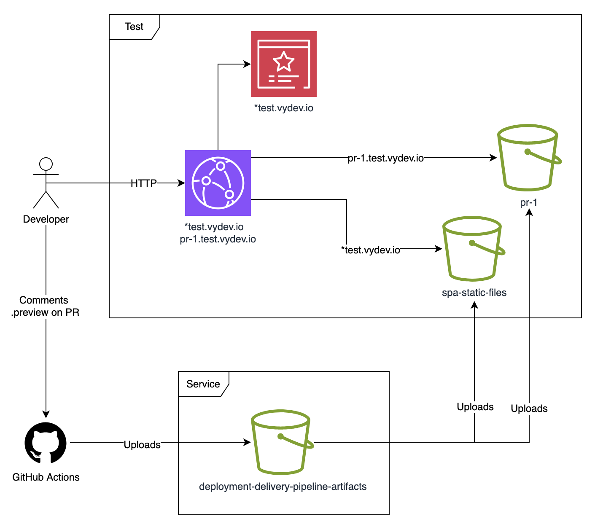

# Terraform AWS Preview URL SPA

Infrastructure to generate preview URLs for Single-Page Applications (SPAs).

## Usage

Remember to check out the [**variables**](variables.tf) and [**outputs**](outputs.tf) to see all options.

```hcl
module "preview_url_spa" {
  source = "github.com/nsbno/terraform-aws-preview-url-spa?ref=x.y.z"
  count  = var.environment == "test" ? 1 : 0  # Only create preview resources in test environment

  service_name     = module.static_site_with_domain.service_name  # Your service name
  base_domain_name = "my-spa.${data.aws_route53_zone.this.name}"  # Your preview base domain (becomes pr-123.{base_domain_name}
}
```

## Relevant Repositories

- [`nsbno/terraform-aws-multi-domain-static-site`](https://github.com/nsbno/terraform-aws-multi-domain-static-site) - Single-Page Application (SPA) infrastructure
- [`nsbno/infrademo-spa`](https://github.com/nsbno/infrademo-spa) - Full working example implementation

## Architecture

