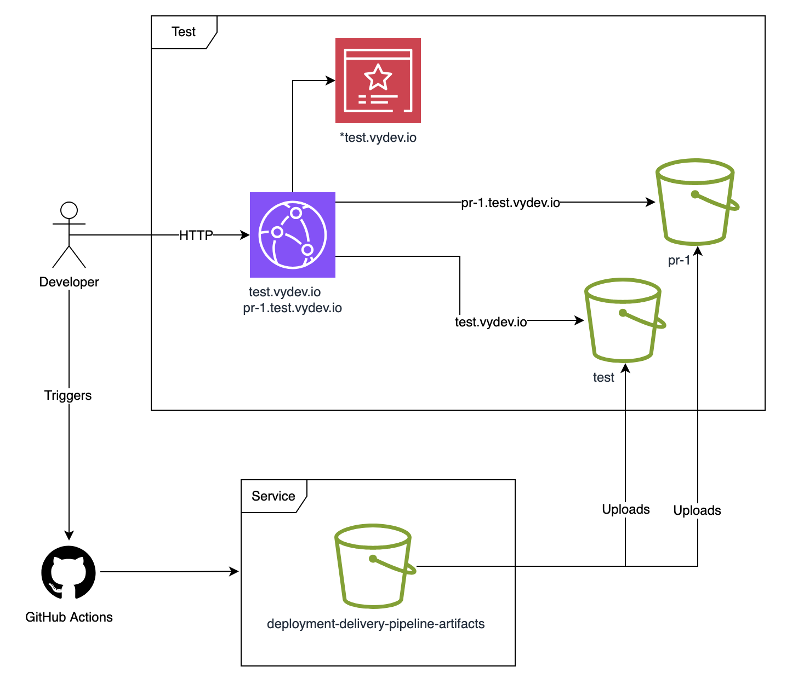

# Terraform AWS Preview URL SPA

Infrastructure to generate preview URLs for Single-Page Applications (SPAs).

## Usage

Remember to check out the [**variables**](variables.tf) and [**outputs**](outputs.tf) to see all options.

```hcl
module "preview_url_spa" {
  source = "github.com/nsbno/terraform-aws-preview-url-spa?ref=x.y.z"
  
  count  = var.environment == "test" ? 1 : 0          # Optional: only create the preview URL resources in test environment

  service_name = "infrademo-spa"                      # Your service name (must match platform-actions workflow parameter)
  domain_name  = "infrademo-spa.test.example.com"     # Your preview base domain (becomes pr-123.infrademo-spa.test.example.com)
  zone_name    = "test.example.com"                   # Your Route53 hosted zone name
}
```

## Relevant Repositories

- [`nsbno/terraform-aws-multi-domain-static-site`](https://github.com/nsbno/terraform-aws-multi-domain-static-site) - Single-Page Application (SPA) infrastructure
- [`nsbno/infrademo-spa`](https://github.com/nsbno/infrademo-spa) - Full working example implementation

## Architecture

